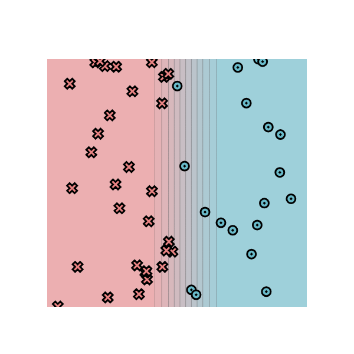
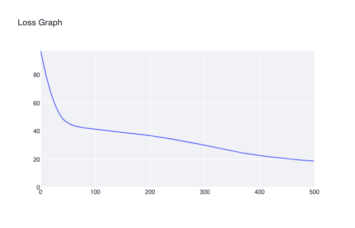

# minitorch
The full minitorch student suite. 


To access the autograder: 

* Module 0: https://classroom.github.com/a/qDYKZff9
* Module 1: https://classroom.github.com/a/6TiImUiy
* Module 2: https://classroom.github.com/a/0ZHJeTA0
* Module 3: https://classroom.github.com/a/U5CMJec1
* Module 4: https://classroom.github.com/a/04QA6HZK
* Quizzes: https://classroom.github.com/a/bGcGc12k

## Task 0.5 — Visualization

Dataset: Simple.

Parameters:
weight_0_0 = -10,
weight_1_0 = 0,
bias_0 = 5.



## Task 1.5 — Scalar training

Dataset: Simple. Points: 50. Hidden layer size: 2. Learning rate: 0.5. Epochs: 500.

### Run 1

```text
Epoch: 10/500, loss: 34.66946727988544, correct: 26
Epoch: 20/500, loss: 34.28728540400772, correct: 26
Epoch: 30/500, loss: 33.955818509479485, correct: 26
Epoch: 40/500, loss: 33.511361886926295, correct: 32
Epoch: 50/500, loss: 32.822504016153935, correct: 42
Epoch: 60/500, loss: 31.95490205400499, correct: 44
Epoch: 70/500, loss: 30.95224098039226, correct: 47
Epoch: 80/500, loss: 29.668190212184925, correct: 48
Epoch: 90/500, loss: 28.046500960746066, correct: 48
Epoch: 100/500, loss: 26.051192718104055, correct: 48
Epoch: 110/500, loss: 23.752739239853444, correct: 48
Epoch: 120/500, loss: 21.256881243821596, correct: 48
Epoch: 130/500, loss: 19.005600808453416, correct: 48
Epoch: 140/500, loss: 16.859724174271943, correct: 48
Epoch: 150/500, loss: 15.133759189394091, correct: 48
Epoch: 160/500, loss: 13.757247497822569, correct: 48
Epoch: 170/500, loss: 12.561433301377258, correct: 48
Epoch: 180/500, loss: 11.55093524360992, correct: 48
Epoch: 190/500, loss: 10.717423406024302, correct: 48
Epoch: 200/500, loss: 9.99106728990099, correct: 48
Epoch: 210/500, loss: 9.358606309566914, correct: 48
Epoch: 220/500, loss: 8.798829421243552, correct: 48
Epoch: 230/500, loss: 8.307971956268396, correct: 48
Epoch: 240/500, loss: 7.8908525192806716, correct: 48
Epoch: 250/500, loss: 7.515551575492784, correct: 48
Epoch: 260/500, loss: 7.176123437447513, correct: 48
Epoch: 270/500, loss: 6.867906376794334, correct: 48
Epoch: 280/500, loss: 6.584755026640016, correct: 48
Epoch: 290/500, loss: 6.323202013138799, correct: 48
Epoch: 300/500, loss: 6.080849539175073, correct: 48
Epoch: 310/500, loss: 5.855663704094792, correct: 48
Epoch: 320/500, loss: 5.645899434887957, correct: 48
Epoch: 330/500, loss: 5.450048138747451, correct: 48
Epoch: 340/500, loss: 5.2667968487179415, correct: 48
Epoch: 350/500, loss: 5.0950107073233255, correct: 48
Epoch: 360/500, loss: 4.9336917395370445, correct: 48
Epoch: 370/500, loss: 4.7819285086825785, correct: 48
Epoch: 380/500, loss: 4.638919730918849, correct: 50
Epoch: 390/500, loss: 4.504696054145734, correct: 50
Epoch: 400/500, loss: 4.381169301333842, correct: 50
Epoch: 410/500, loss: 4.264242066711315, correct: 50
Epoch: 420/500, loss: 4.153189917184033, correct: 50
Epoch: 430/500, loss: 4.047586106815597, correct: 50
Epoch: 440/500, loss: 3.9470455339045074, correct: 50
Epoch: 450/500, loss: 3.851219165050423, correct: 50
Epoch: 460/500, loss: 3.759789636025797, correct: 50
Epoch: 470/500, loss: 3.6724675196790972, correct: 50
Epoch: 480/500, loss: 3.5889881454296617, correct: 50
Epoch: 490/500, loss: 3.50910887488159, correct: 50
Epoch: 500/500, loss: 3.4326067562508626, correct: 50
```

Loss curve for run 1:

.png)

---

Dataset: Diag. Points: 100. Hidden layer size: 3. Learning rate: 0.5. Epochs: 500.

### Run 2

```text
Epoch: 10/500, loss: 81.16821314464565, correct: 17
Epoch: 20/500, loss: 66.88457440592488, correct: 71
Epoch: 30/500, loss: 56.478631106354534, correct: 83
Epoch: 40/500, loss: 49.53640584215712, correct: 83
Epoch: 50/500, loss: 46.02994400099916, correct: 83
Epoch: 60/500, loss: 44.180262369996484, correct: 83
Epoch: 70/500, loss: 43.099583172153245, correct: 83
Epoch: 80/500, loss: 42.39651255786555, correct: 83
Epoch: 90/500, loss: 41.87214135999374, correct: 83
Epoch: 100/500, loss: 41.42524328237988, correct: 83
Epoch: 110/500, loss: 41.006184124382145, correct: 83
Epoch: 120/500, loss: 40.592689313708895, correct: 83
Epoch: 130/500, loss: 40.17751477312025, correct: 83
Epoch: 140/500, loss: 39.7528955830113, correct: 83
Epoch: 150/500, loss: 39.33298183627926, correct: 83
Epoch: 160/500, loss: 38.89357384545971, correct: 83
Epoch: 170/500, loss: 38.4296376715916, correct: 83
Epoch: 180/500, loss: 37.93828429504231, correct: 83
Epoch: 190/500, loss: 37.423692529843336, correct: 83
Epoch: 200/500, loss: 36.884495251667, correct: 83
Epoch: 210/500, loss: 36.31967503690326, correct: 83
Epoch: 220/500, loss: 35.727017855285915, correct: 83
Epoch: 230/500, loss: 35.10586886380294, correct: 83
Epoch: 240/500, loss: 34.45658545754513, correct: 83
Epoch: 250/500, loss: 33.77887435831961, correct: 83
Epoch: 260/500, loss: 33.0747808587293, correct: 83
Epoch: 270/500, loss: 32.34273337232415, correct: 83
Epoch: 280/500, loss: 31.584112495783714, correct: 83
Epoch: 290/500, loss: 30.803694397390483, correct: 83
Epoch: 300/500, loss: 30.004425729219072, correct: 83
Epoch: 310/500, loss: 29.189977623198267, correct: 83
Epoch: 320/500, loss: 28.362247499876393, correct: 83
Epoch: 330/500, loss: 27.524073456139234, correct: 83
Epoch: 340/500, loss: 26.679707472519592, correct: 83
Epoch: 350/500, loss: 25.83458120324736, correct: 86
Epoch: 360/500, loss: 25.112429379169136, correct: 86
Epoch: 370/500, loss: 24.491529478674636, correct: 86
Epoch: 380/500, loss: 23.88732081434211, correct: 87
Epoch: 390/500, loss: 23.294202355783217, correct: 87
Epoch: 400/500, loss: 22.740758071048315, correct: 88
Epoch: 410/500, loss: 22.223017050045105, correct: 89
Epoch: 420/500, loss: 21.723866703437384, correct: 90
Epoch: 430/500, loss: 21.269039439045194, correct: 91
Epoch: 440/500, loss: 20.83341638796058, correct: 91
Epoch: 450/500, loss: 20.434629586956504, correct: 91
Epoch: 460/500, loss: 20.053561962680217, correct: 92
Epoch: 470/500, loss: 19.704685876203087, correct: 92
Epoch: 480/500, loss: 19.372220588622024, correct: 93
Epoch: 490/500, loss: 19.062455234628665, correct: 93
Epoch: 500/500, loss: 18.76728979693281, correct: 93
```

Loss curve for run 2:



---

Dataset: Split. Points: 100. Hidden layer size: 10. Learning rate: 0.5. Epochs: 500.

### Run 3

```text
Epoch: 10/500, loss: 72.30579657032453, correct: 51
Epoch: 20/500, loss: 69.00027293349228, correct: 49
Epoch: 30/500, loss: 67.61136419371635, correct: 57
Epoch: 40/500, loss: 66.68263203592964, correct: 61
Epoch: 50/500, loss: 65.63184910217488, correct: 63
Epoch: 60/500, loss: 65.04275177467261, correct: 62
Epoch: 70/500, loss: 64.65181666843716, correct: 65
Epoch: 80/500, loss: 64.29979352964278, correct: 68
Epoch: 90/500, loss: 63.994660426178285, correct: 68
Epoch: 100/500, loss: 63.71673459742596, correct: 68
Epoch: 110/500, loss: 63.45027484826093, correct: 71
Epoch: 120/500, loss: 63.18206079885605, correct: 72
Epoch: 130/500, loss: 62.91299091258943, correct: 72
Epoch: 140/500, loss: 62.63690823426683, correct: 73
Epoch: 150/500, loss: 62.35246246293089, correct: 73
Epoch: 160/500, loss: 62.059573085087244, correct: 74
Epoch: 170/500, loss: 61.74300173266758, correct: 74
Epoch: 180/500, loss: 61.38795910923999, correct: 74
Epoch: 190/500, loss: 61.020503188212174, correct: 74
Epoch: 200/500, loss: 60.651739928344334, correct: 73
Epoch: 210/500, loss: 60.23604509237975, correct: 74
Epoch: 220/500, loss: 59.8101867395455, correct: 78
Epoch: 230/500, loss: 59.3680303532321, correct: 79
Epoch: 240/500, loss: 58.912664756346324, correct: 81
Epoch: 250/500, loss: 58.453134556823336, correct: 81
Epoch: 260/500, loss: 57.99698476844042, correct: 82
Epoch: 270/500, loss: 57.533588453871396, correct: 82
Epoch: 280/500, loss: 57.05107015625626, correct: 81
Epoch: 290/500, loss: 56.5297693469446, correct: 81
Epoch: 300/500, loss: 56.010059280555076, correct: 82
Epoch: 310/500, loss: 55.446654698038664, correct: 84
Epoch: 320/500, loss: 54.86348198728241, correct: 84
Epoch: 330/500, loss: 54.25584315918869, correct: 84
Epoch: 340/500, loss: 53.62146834823833, correct: 84
Epoch: 350/500, loss: 52.92261587122201, correct: 84
Epoch: 360/500, loss: 52.18933697604727, correct: 85
Epoch: 370/500, loss: 51.396473762858335, correct: 87
Epoch: 380/500, loss: 50.5978129113189, correct: 88
Epoch: 390/500, loss: 49.783341070928635, correct: 91
Epoch: 400/500, loss: 48.95140332551852, correct: 92
Epoch: 410/500, loss: 48.09711025208201, correct: 93
Epoch: 420/500, loss: 47.22865279499751, correct: 93
Epoch: 430/500, loss: 46.33072266724065, correct: 94
Epoch: 440/500, loss: 45.167507759154745, correct: 94
Epoch: 450/500, loss: 43.91479162835858, correct: 94
Epoch: 460/500, loss: 42.77564271082622, correct: 94
Epoch: 470/500, loss: 41.640466379815166, correct: 94
Epoch: 480/500, loss: 40.510067655901025, correct: 94
Epoch: 490/500, loss: 39.44732741896695, correct: 94
Epoch: 500/500, loss: 38.4007267009933, correct: 94
```

Loss curve for run 3:

.png)

---

Dataset: Xor. Points: 100. Hidden layer size: 10. Learning rate: 0.5. Epochs: 500.

### Run 4

```text
Epoch: 10/500, loss: 68.3501361775785, correct: 54
Epoch: 20/500, loss: 63.91762771490369, correct: 54
Epoch: 30/500, loss: 61.98094306285821, correct: 58
Epoch: 40/500, loss: 60.49483988497013, correct: 73
Epoch: 50/500, loss: 59.264939553157184, correct: 79
Epoch: 60/500, loss: 58.181777917050844, correct: 82
Epoch: 70/500, loss: 57.13870329024319, correct: 84
Epoch: 80/500, loss: 56.173289880073604, correct: 86
Epoch: 90/500, loss: 55.25822869554976, correct: 88
Epoch: 100/500, loss: 54.35138323327089, correct: 90
Epoch: 110/500, loss: 53.446518939384795, correct: 90
Epoch: 120/500, loss: 52.5408544021182, correct: 91
Epoch: 130/500, loss: 51.63170475911153, correct: 90
Epoch: 140/500, loss: 50.71331854176034, correct: 90
Epoch: 150/500, loss: 49.792651757230715, correct: 90
Epoch: 160/500, loss: 48.86535174101949, correct: 90
Epoch: 170/500, loss: 47.94724932671342, correct: 91
Epoch: 180/500, loss: 47.04038057383841, correct: 91
Epoch: 190/500, loss: 46.133272246589094, correct: 91
Epoch: 200/500, loss: 45.23308597816259, correct: 91
Epoch: 210/500, loss: 44.34175065296869, correct: 91
Epoch: 220/500, loss: 43.4574626650947, correct: 91
Epoch: 230/500, loss: 42.58287835334433, correct: 90
Epoch: 240/500, loss: 41.72708368865812, correct: 90
Epoch: 250/500, loss: 40.890974457122994, correct: 90
Epoch: 260/500, loss: 40.0761509946527, correct: 90
Epoch: 270/500, loss: 39.281916599976746, correct: 90
Epoch: 280/500, loss: 38.50788137365156, correct: 90
Epoch: 290/500, loss: 37.75923872013303, correct: 90
Epoch: 300/500, loss: 37.03466026930552, correct: 90
Epoch: 310/500, loss: 36.33322924209831, correct: 90
Epoch: 320/500, loss: 35.655370269469884, correct: 90
Epoch: 330/500, loss: 35.00135138348084, correct: 90
Epoch: 340/500, loss: 34.37083351425225, correct: 90
Epoch: 350/500, loss: 33.76477140667071, correct: 89
Epoch: 360/500, loss: 33.17994751293198, correct: 89
Epoch: 370/500, loss: 32.61925185209358, correct: 89
Epoch: 380/500, loss: 32.07894027165493, correct: 90
Epoch: 390/500, loss: 31.55685981047054, correct: 90
Epoch: 400/500, loss: 31.055264139493417, correct: 90
Epoch: 410/500, loss: 30.57286205417037, correct: 90
Epoch: 420/500, loss: 30.10948459063144, correct: 90
Epoch: 430/500, loss: 29.66024636451527, correct: 90
Epoch: 440/500, loss: 29.238167057869457, correct: 91
Epoch: 450/500, loss: 28.835745289136206, correct: 91
Epoch: 460/500, loss: 28.451409667104706, correct: 91
Epoch: 470/500, loss: 28.085766114430648, correct: 91
Epoch: 480/500, loss: 27.734621186268043, correct: 91
Epoch: 490/500, loss: 27.397506293053613, correct: 91
Epoch: 500/500, loss: 27.074807611816507, correct: 91
```

.png)
